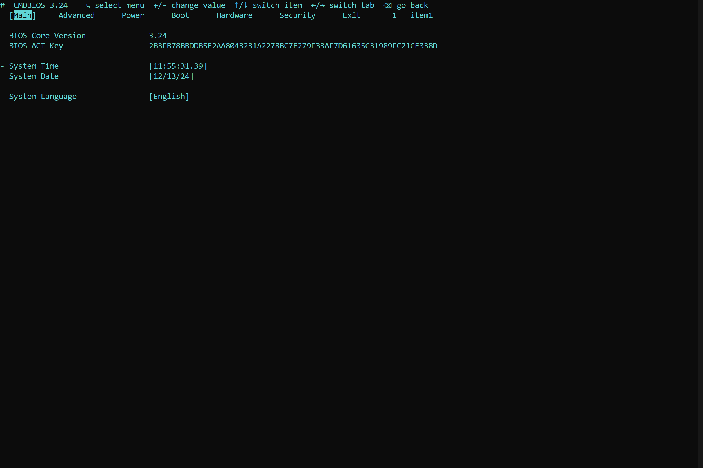
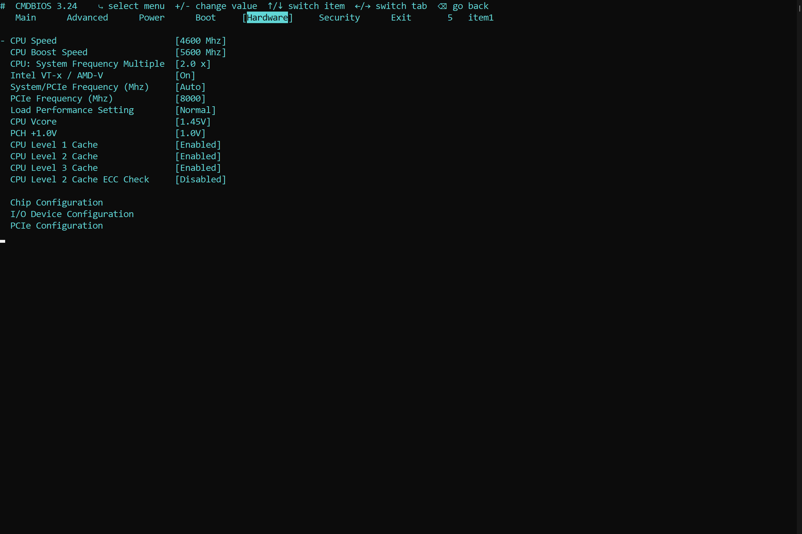
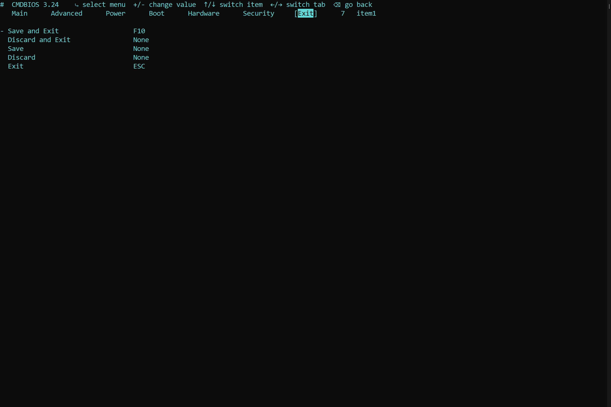

# CMDBIOS
A BIOS written in Batchscript


**CMDBIOS is based off of multiple different versions and differences of AMIBIOS, PhoenixBIOS, and AwardBIOS**

> Note: CMDBIOS Only represents a BIOS interface with limited capabilities.
> CMDBIOS DOES NOT CHANGE ANY DEVICE OR BIOS SETTINGS

## Screenshots






---

## Setup

### File/Folder Structure

```
bios
  /batbox.exe
  /bios.bat
  /cinderblock-small-notext.bat
```

### CMD Window Requirements

If you are using Windows 10, you can skip this section
If you are using Windows 11:
1. Open **PowerShell**
2. Right-Click on the tab bar and select **Settings**
3. Select **Default Terminal Application** and set to **Windows Console Host**
4. Save settings


>User and admin PW to be added in a later update
